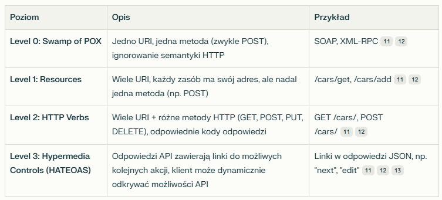

## HTTP

HTTP to protokół warstawy aplikacji służący do przesyłania różnorodnych zasobów, takich jak strony HTML, pliki graficzne czy dane aplikacji. Działa w architekturze klient-serwer, w którym klient wysyła żądania do serwera WWW, który zwraca odpowiedzi. 

Cechy HTTP: 
- bezstanowość - każde połączenie jest niezależne i serwer nie pamięta wcześniejszych interakcji
- bezpołączeniowość - po zakończeniu wymiany danych połączenie jest zwykle zamykane
- domyślny port - TCP 80 (HTTP), TCP 443 (HTTPS)

## Żądanie HTTP

- metoda (GET, POST itd) i ścieżka do zasobu
- nagłówki - parametry w formie nazwa: wartość
- pusta linia
- opcjonalne dane - dane do obsługi żądania POST. 

## Najważniejsze metody

- GET - pobiera zasób
- POST - wysyła dane do serwera
- PUT - aktualizuje zasób
- DELETE - usuwa zasób
- HEAD - zwraca tylko nagłówki, bez danych

## Kody odpowiedzi

- 1xx: Informacyjne
- 2xx: Sukces (np. 200 OK)
- 3xx: Przekierowania (np. 301, 304)
- 4xx: Błędy klienta (np. 404 Not Found, 403 Forbidden)
- 5xx: Błędy serwera (np. 500 Internal Server Error)

## Cookies

Ciasteczka służą do utrzymania sesji, personalizacji i statystyk. Przesyłane są w nagłówkach Set-Cookie (serwer → klient) oraz Cookie (klient → serwer).

## HTTP/2

- wiele żądań i odpowiedzi w jednym połączeniu. 
- HPACK - kompresja nagłówków
- binarny format wiadomości
- server push - serwer może wysyłać dane zamin klient o nie poprosi

## HTTP/3

- protokół QUIC oparty o UDP - sybsze zestawienie połączeń
- QPACK - lepsza kompresja nagłówków
- bezpieczeństwo - obowiązkowy TLS 1.3

## HTTPS

- konieczne szyfrowanie danych za pomocą SSL/TLS

## REST

REST to zbiór zasad projektowania API, które umożliwiają prostą, skalowalną i elastyczną komunikację klient-serwer. 

Zasady: 

- architektura klient-serwer
- jednolity interfejs - spójny sposób interakcji z zasobami
- bezstanowość - serwer nie pamięta poprzednich interakcji, nie przechowuje danych
- buforowanie - możliwość cacheowania
- system warstwowy - możliwość wprowadzenia warstw pośredniczących (np. proxy, cache)

W REST wszystko jest zasobem dostępnym przez ogólnodostępny interfejs. Zasoby można identyfikować przez URI który składa się z URL i URN. 

## Operacja idempotentna

Operacja jest idempotentna jeżeli wielokrotne wykonanie jej daje ten sam efekt co pojedyncze (np. GET, PUT, DELETE). To pozwala na bezpieczne powtarzanie żądań bez ryzyka zmiany stanu. 

## Stopnie dojrzałości RESTful API. 

