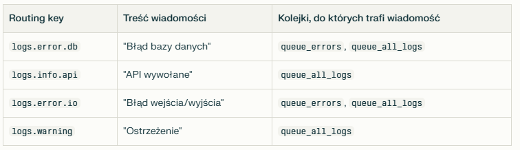
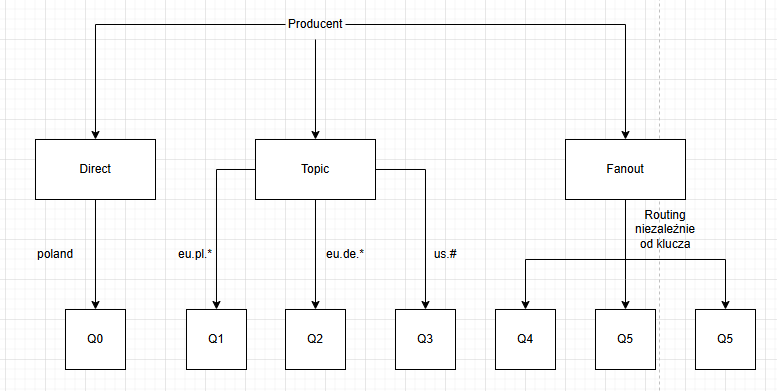

## Modele komunikacji

### Komunikacja synchroniczna

- obie strony muszą być aktywne w tym samym czasie
- wywołania są blokujące - nadawca czeka na odpowiedź odbiorcy

### Komunikacja asynchroniczna 

- obie strony nie muszą być aktywne jednocześnie
- wywołania są nieblokujące - nadawca może kontynuowac pracę po wysłaniu wiadomości

### Komunikacja z potwierdzeniem odbioru

- nadawca ocekuje na potwierdzenie odbioru
- odbiorca musi poinformowac nadawcę, że odebrał/przetworzył wiadomość
- zwiększa to niezawodność systemu

## Message Oriented Middleware

Wiadomości to alternatywna dla klasycznych wywołań metod, zamiast sztywnego interfejsu komunikacja opiera się na formacie wiadomości. Pozwala to na luźne powiązania między komponentami systemu. MOM to warstwa pośrednicząca obsługująca przesyłanie, buforowanie, routowanie i potwierdzanie wiadomości między producentami i konsumentami. 

## RabbitMQ

Kluczowe cechy: 

- Routing - zaawansowane mechanizmy wyboru ścieżki przesyłania wiadomości (exchange)
- Niezawodność - potwierdzenie odbioru
- Wsparcie protokołów AMQP, MQTT, STOMP
- Wielojęzyczność - klienty dla wielu języków programowania
- Admin UI - graficzny interfejs do monitorowania i zarządzania serwerem

Elementy architektury: 
- Broker (serwer) - centralny punkt przyjmujący, przechowujący i przekazujący wiadomości
- Producent - aplikacja wysyłająca wiadomości do brokera
- Konsument - aplikacja odbierająca wiadomości od brokera
- Admin UI - graficzny interfejs do monitorowania i zarządzania serwerem

## Potwierdzenia wiadomości

Są dwie możliwości potwierdzenia wiadomości: 
- po odebraniu 
- po przetworzeniu

Jeżeli konsument nie potwierdzi odbioru, to RabbitMQ uznaje, że nie została przetworzona i dostarczy ją innemu konsumentowi. 

## Exchange

Exchange to mechanizm routingu w którym producent wysyła wiadomość do exchange a nie bezpośrednio do kolejki. Exchange na podstawie reguł routingu i powiązań decyduje do których kolejek trafi wiadomość. Możliwe jest wysłanie tej samej wiadomości do wielu kolejek

## Typy exchange

- direct - routing na podstawie dokładnego klucza
- fanout - broadcast niezależnie od klucza
- topic - routing na podwstawie wzorca

Przykład exchange topic: 
Mamy kolejki `queue_errors` powiązana z kluczem `logs.error.*` oraz `queue_all_logs` powiązana z kluczem `logs.#`.

## Load balancing

W RabbitMQ są dostępne dwie metody loadbalancingu: 

- Round Robin - domyślny algorytm - wiadomości są rozdzielane po kolei do dostępnych konsumentów
- Fair Dispatch - każdy konsument otrzymuje tyle wiadomości ile jest w stanie przetworzyć, kontrolowane przez parametr prefetchCount który okresla maksymalną liczbę niepotwierdzonych wiadomości przypisanych do konsumenta. 

## Pytania z kolokwiów

### 1. Jakie są typy exchange i jak one działają?

Exchange to mechanizm routingu w RabbitMQ, w którym nadawca nie wysyła wiadomości bezpośrednio do kolejki, tylko do exchange, które na podstawie zdefiniowanych reguł routingu oraz powiązań przekazuje wiadomość do odpowiedniej kolejki. Można wysyłać jedną wiadomość do wielu kolejek. 

Typy exchange: 

- direct - kluczem routingu musi być dokładna nazwa
- fanout - działa jak broadcast, wiadomość trafi do wszystkich kolejek
- topic - tylko prefix klucza musi się zgadzać, istnieją wildcardy, * - jedno słowo, # - zero lub dowolny ciąg znaków

### 2. Rysunek do typów exchange

### 3. Opisz pojęcia

#### QOS 

QOS - Quality of Service to mechanizm który pozwala ograniczyć liczbę niepotwierdzonych wiadomości, jakie broker może wysłać do konsumenta zanim otworzyma potwierdzenie przetworzenia tych wiadomości. Ta liczba jest definiowana w parametrze prefetchCount który określa ile niepotwierdzonych wiadomości dany konsument może mieć.

#### Load balancing

Load balancing to mechanizm efektywnego rozdzielania wiadomości do przetworzenia pomiędzy dostępnych konsumentów. W rabbitMQ domyślnym mechanizmem load balancingu jest algorytm `Round Robin` który rozdziela wiadomości po kolei dla kolejnych dostępnych konsumentów. Inny algorytm to `Fair Dispatch`, który wysła tyle wiadomości do konsumenta, ile jest w stanie przetworzyć. Ta liczba jest definiowana w parametrze prefetchCount który określa ile niepotwierdzonych wiadomości dany konsument może mieć.

#### Komunikacja asynchroniczna

Komunikacja asynchroniczna pomiędzy dwoma procesami jest nieblokująca i nie wymaga, żeby oba procesy były aktywne w momencie wysyłania wiadomości. Nadawca po wysłaniu wiadomości może kontynuuować dalszą pracę.