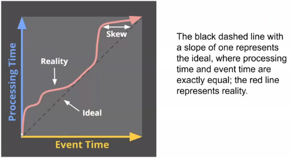

## Podstawowe pojęcia 

- Dane ograniczone to zbiory danych, które nie zmieniają się w czasie. Przetwarzanie polega na operacjach na ustalonej paczce danych. 
- Dane nieograniczone to dane napływające w sposób ciągły, często dzielone na okna czasowe do przetwarzania ich (streaming). 

## Event time vs Processing time

- event time to czas wystąpienia zdarzenia
- processing time to czas zaobserwowania zdarzenia przez system
- opóźnienie (latency) - różnica między processing time a event time. Idealnie byłoby gdyby opóźnienie nie występowało, ale w praktyce to niemożliwe. 

## Okna czasowe 

- stałe okno (fixed) - np. co godzinę
- przesuwne okno (sliding) - np. ostatnie 30 minut, przesuwa się w czasie
- okno sesji (session) - wyznaczane przez odstępy między zdarzeniami od tego samego źródła. 

## Przestrzeń czasowa okien

- processing time - łatwe do implementacji, buforowanie proste
- event time - trudniejsze do implementacji, bo zdarzenia mogą docierać z opóźnieniem i nie wiadomo, kiedy wszystkie dotrą

## Problemy przetwarzania w event time

- buforowanie - trzeba długo utrzymywać bufory, żeby zebrać wszystkie dane z danego okresu
- kompletnosć - nie wiadomo, kiedy można uznać, żę wszystkie dane z okna już dotarły

## Podejścia do przetwarzania strumieniowego

- time-agnostic - przetwarzanie niezależnie od czasu
- aproksymacyjne - przybliżanie różnicy pomiędzy event time a processing time
- okna processing time - okna wyznaczane na podstawie czasu przetwarzania
- okna event time - okna wyznaczane na podstawie czasu wystąpienia zdarzeń

## Watermark 

Watermark to funkcja, która dla danego processing time zwraca event time, do któego mamy już komplet danych.
Może być 

- perfect watermark - pewność, że żadne zdarzenia po przekroczeniu watermarku nie dotrą
- heuristic watermark - okreslany heurystycznie z jakimś prawdopodobieństwem

## Trigger

Trigger okresla, kiedy uznajemy okno za kompletne i przekazujemy dane do dalszego przetwarzanaia. Może być wyzwalany przez watermark, czasowo, po liczbie zdarzeń lub na podstawie treści zdarzenia. 

## Horyzont opóźnienia

Horyzont opóźnienia określa jak długo dopuszczamy opóźnienia przy zbieraniu danych do okna. Często czeka się jeszcze pewień czas po zakończeniu okna, by zebrać spóźnione zdarzenia. 

## Akumulacja

- discarding - usuwamy poprzednie dane, zostawiamy tylko nowe
- accumulating - dodajemy nowe dane do poprzednich
- accumulating & retracting - dodajemy nowe, ale też usuwamy nieaktualne dane

## Modele przetwarzania

- what - rodzaj transformacji, element-wise, agregacja, kompozycja
- where - sposób wyznaczania okien (fixed, sliding, session)
- when - kiedy uznajemy dane za kompletne (watermark, trigger)
- how - relacja pomiędzy nowymi i starymi danymi (discarding, accumulating (& retracting))

## Event driven & zdarzenie

Zdarzenie ma miejsce i czas wystąpienia, strukturę, informację, przyczynę, skutek i warunki wystąpienia. 
Przetwarzanie zdarzeń różni się od przetwarzania danych tym, że zapytania aplikowane są do napływających danych.